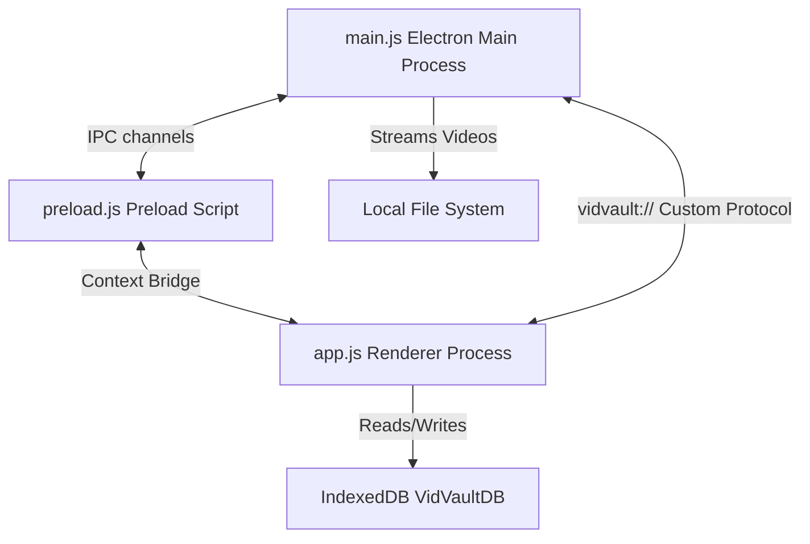

# VidVault — AI Model / Developer Handoff Document

This technical guide outlines the architecture, data models, state management, and critical pathways of VidVault. It provides a blueprint for an AI model or developer to continue building features or to refactor the project into an open, FastStone-style file viewer.

---

## 1. Technical Architecture Overview

VidVault is a local-first Electron application built with Vanilla JS, HTML5, and standard CSS. It operates offline and secures local file access via a custom protocol.



### Core Codebase Entry Points
1. **[main.js](file:///c:/Users/Gulam%20Mustafa/Games/Vapp/main.js)**: Runs in the Node.js environment. Spawns the Chromium window, handles native dialog directories (`select-folder`), performs recursive file-system scans, and serves local videos via a streaming protocol.
2. **[preload.js](file:///c:/Users/Gulam%20Mustafa/Games/Vapp/preload.js)**: Exposes a secure, limited bridge (`window.electronAPI`) containing IPC methods for directory selection, file queries, and path resolution.
3. **[index.html](file:///c:/Users/Gulam%20Mustafa/Games/Vapp/index.html)**: The DOM structure. Links to the stylesheet and loads `app.js` as the monolithic script.
4. **[src/css/style.css](file:///c:/Users/Gulam%20Mustafa/Games/Vapp/src/css/style.css)**: The unified design stylesheet (Final Hybrid Design System). Contains the dark Spotify-like layout, cards, custom timelines, dialog overlays, context menus, and scrollbar styling.
5. **[src/js/app.js](file:///c:/Users/Gulam%20Mustafa/Games/Vapp/src/js/app.js)**: The monolithic script orchestrating state management, IndexedDB operations, timeline manipulation, playlist logic, tags, autocomplete, and markdown rendering.

---

## 2. Data Flow & Security (The Custom Protocol)

Because Chromium blocks direct access to local files (`file://`) due to Web Security policies, VidVault registers a custom protocol scheme `vidvault://`.

- **Scheme format**: `vidvault://local/<absolute-file-path>`
- **Byte-Range Streaming**: `main.js` intercepts requests to `vidvault://local/` and reads files using Node `fs.createReadStream`. It parses the HTTP `Range` header to return `206 Partial Content` slices. This is critical for HTML5 `<video>` tags to support instant seeking and timeline skipping in large video files.

---

## 3. Database Schema (IndexedDB)

All user configurations, tags, watch states, and metadata are saved inside IndexedDB.
- **Database Name**: `VidVaultDB` (Version 3)
- **Database Store Name**: `VidVaultHandleDB` (Version 1) — stores the directory file handle on web versions.
- **Tables**:
  - `metadata` (Key: `id` [video filename]):
    ```json
    {
      "id": "10_Common_Photo_Mistakes.mp4",
      "liked": true,
      "disliked": false,
      "progress": 345.12, 
      "duration": 602.4,
      "notes": "My notes with #photo and [[OtherVideo.mp4]]",
      "properties": {
        "Creator": "Lightroom Team"
      },
      "thumbnail": "data:image/jpeg;base64,..."
    }
    ```
  - `playlists` (Key: `name`):
    ```json
    {
      "name": "My Favorites",
      "files": ["10_Common_Photo_Mistakes.mp4", "Tutorial2.mp4"]
    }
    ```

---

## 4. UI Elements & State Tracking

`app.js` holds the runtime state of the application:
- `allVideoFiles`: Array of files. In desktop mode, these are plain objects with `{ name, path, relativePath, size, lastModified }`.
- `currentVideo`: The currently playing video file object.
- `videoQueue`: Array of video objects queued up for "Up Next" playback.
- `uniqueAlbums`: A `Set` of folder names inside the root vault directory.

---

## 5. Blueprint: Transitioning to an Open "FastStone Viewer" Style App

If you want to refactor the project from a "managed database catalog" model (like Adobe Lightroom) to an "open directory browser" model (like FastStone Image Viewer or Adobe Bridge), use this step-by-step transition guide:

### Core Difference
| Feature | Lightroom Managed Model (Current) | FastStone Open Model (Proposed) |
| :--- | :--- | :--- |
| **Directory Scope** | Locked to a single mounted vault root. | Dynamic. Can browse any folder on the system. |
| **Metadata Location** | Embedded inside a central browser database (`IndexedDB`). | Stored alongside each video (e.g., as `.meta.json` or `.txt` files). |
| **Folder Parsing** | Recursive scan of the entire tree on load. | Lazy-loaded directory traversal (reads only the selected folder). |
| **Portability** | Moving folders breaks notes; database stays behind. | Folder is self-contained. Move it anywhere, notes stay. |

### Implementation Guide for FastStone Style

#### Step A: Expose a Directory Navigation API in `main.js`
Expose standard Node `fs` methods over the IPC channel so the renderer process can browse the folder tree:
```javascript
// In main.js
ipcMain.handle('read-directory', async (_, dirPath) => {
    const entries = fs.readdirSync(dirPath, { withFileTypes: true });
    return entries.map(e => ({
        name: e.name,
        path: path.join(dirPath, e.name),
        isDirectory: e.isDirectory(),
        size: e.isDirectory() ? 0 : fs.statSync(path.join(dirPath, e.name)).size,
        lastModified: e.isDirectory() ? 0 : fs.statSync(path.join(dirPath, e.name)).mtimeMs
    }));
});
```

#### Step B: Replace IndexedDB with Sidecar Files
Instead of saving note-taking data to IndexedDB, save metadata directly alongside the video file (e.g. `videoName.meta.json`):
```javascript
// In main.js
ipcMain.handle('save-metadata', async (_, videoPath, data) => {
    const metaPath = videoPath + '.meta.json';
    fs.writeFileSync(metaPath, JSON.stringify(data, null, 2), 'utf-8');
});

ipcMain.handle('get-metadata', async (_, videoPath) => {
    const metaPath = videoPath + '.meta.json';
    if (fs.existsSync(metaPath)) {
        return JSON.parse(fs.readFileSync(metaPath, 'utf-8'));
    }
    return null;
});
```

#### Step C: Build a Folder Tree Sidebar
Update `index.html`'s sidebar to render a collapsible directory tree.
- When a folder node is clicked, set `currentFolderPath = folder.path`.
- Call `read-directory` for `currentFolderPath` and render only that folder's contents in the main grid (splitting folders and files like a native explorer).

#### Step D: Update `app.js` UI Hooks
- Replace `dbGet` and `dbPut` calls with calls to `window.electronAPI.getMetadata(video._path)` and `window.electronAPI.saveMetadata(video._path, metadata)`.
- Re-trigger `renderGrid()` whenever `currentFolderPath` changes, loading thumbnails from sidecar fields on the fly.
